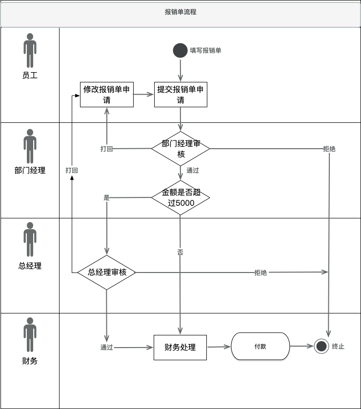
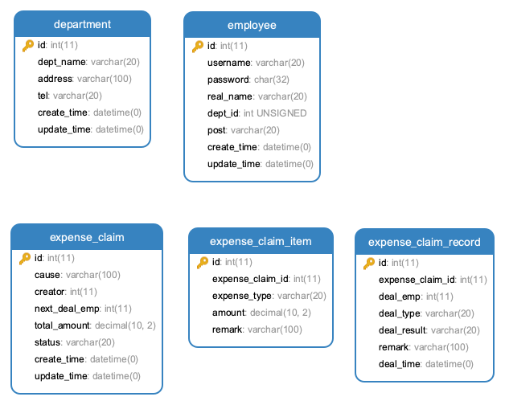

# SSM-OA

## 员工信息管理
* 员工列表
* 添加员工
* 修改员工
* 删除员工

```$xslt
系统预置的账号:

    10000 111
    
    10001 111
    
    10002 111
    
    10003 111
```
    

## 部门信息管理
* 部门列表
* 添加部门
* 修改部门
* 删除部门

## 登录以及个人中心
* 登录操作(session)
* 登出操作
* 个人中心页面
* 修改密码

## 报销单处理
###主要角色: 员工、部门经理、总经理、财务

###角色行为:
* 员工
    - 创建报销单
    - 保存报销单
    - 修改报销单
    - 提交报销单
        
* 部门经理
    - 查询部门经理待审核的报销单
    - 部门经理审核报销单

* 总经理
    - 查询总经理待审核的报销单
    - 总经理审核报销单
        
* 财务
    - 查询财务待处理的报销单
    - 财务处理报销单(付款) 
    
###报销单处理流程  
> 填写 -> 提交 -> 审核 -> 打款



### 数据库设计



```mysql
DROP DATABASE IF EXISTS oa;

CREATE DATABASE oa;
USE oa;

DROP TABLE IF EXISTS `department`, `employee`, `expense_claim`, `expense_claim_item`, `expense_claim_record`;

CREATE TABLE `department` (
	`id` INT(11) NOT NULL AUTO_INCREMENT COMMENT '部门编号',
  	`dept_name` VARCHAR(20) NOT NULL COMMENT '部门名称',
  	`address` VARCHAR(100) NOT NULL DEFAULT '' COMMENT '部门地址',
  	`tel` VARCHAR(20) NOT NULL DEFAULT '' COMMENT '部门电话',
  	`create_time` DATETIME NOT NULL DEFAULT CURRENT_TIMESTAMP COMMENT '创建时间',
  	`update_time` DATETIME NOT NULL DEFAULT CURRENT_TIMESTAMP ON UPDATE CURRENT_TIMESTAMP COMMENT '修改时间',
  	PRIMARY KEY (`id`)
) ENGINE=InnoDB AUTO_INCREMENT=100 DEFAULT CHARSET=utf8mb4 COLLATE=utf8mb4_unicode_ci COMMENT='部门信息表';

CREATE TABLE `employee` (
  `id` INT(11) NOT NULL AUTO_INCREMENT COMMENT '员工编号',
  `username` VARCHAR(20) NOT NULL COMMENT '用户名',
  `password` CHAR(32) NOT NULL COMMENT '密码',
  `real_name` VARCHAR(20) NOT NULL DEFAULT '' COMMENT '姓名',
  `dept_id` INT(11) UNSIGNED NOT NULL COMMENT '部门编号',
  `post` VARCHAR(20) NOT NULL COMMENT '职位',
  `create_time` DATETIME NOT NULL DEFAULT CURRENT_TIMESTAMP COMMENT '创建时间',
  `update_time` DATETIME NOT NULL DEFAULT CURRENT_TIMESTAMP ON UPDATE CURRENT_TIMESTAMP COMMENT '修改时间',
  PRIMARY KEY (`id`),
  UNIQUE KEY `uni_username` (`username`) USING BTREE
) ENGINE=InnoDB AUTO_INCREMENT=10000 DEFAULT CHARSET=utf8mb4 COLLATE=utf8mb4_unicode_ci COMMENT='员工信息表';

CREATE TABLE `expense_claim` (
	`id` INT(11) NOT NULL AUTO_INCREMENT COMMENT '报销单编号',
	`cause` VARCHAR(100) NOT NULL DEFAULT '' COMMENT '事由',
	`creator` INT(11) NOT NULL COMMENT '创建人员工编号',
	`next_deal_emp` INT(11) NOT NULL COMMENT '待处理人员工编号',
	`total_amount` DECIMAL(10, 2) NOT NULL COMMENT '报销总金额',
	`status` VARCHAR(20) NOT NULL COMMENT '报销单状态',
	`create_time` DATETIME NOT NULL DEFAULT CURRENT_TIMESTAMP COMMENT '创建时间',
	`update_time` DATETIME NOT NULL DEFAULT CURRENT_TIMESTAMP ON UPDATE CURRENT_TIMESTAMP COMMENT '修改时间',
	PRIMARY KEY (`id`)
) ENGINE=InnoDB AUTO_INCREMENT=1 DEFAULT CHARSET=utf8mb4 COLLATE=utf8mb4_unicode_ci COMMENT='报销单表';

CREATE TABLE `expense_claim_item` (
	`id` INT(11) NOT NULL AUTO_INCREMENT COMMENT '报销单明细编号',
	`expense_claim_id` INT(11) NOT NULL COMMENT '报销单编号',
	`expense_type` VARCHAR(20) NOT NULL COMMENT '费用类型',
	`amount` DECIMAL(10, 2) NOT NULL COMMENT '报销金额',
	`remark` VARCHAR(100) NOT NULL DEFAULT '' COMMENT '备注',
	PRIMARY KEY (`id`)
) ENGINE=InnoDB AUTO_INCREMENT=1 DEFAULT CHARSET=utf8mb4 COLLATE=utf8mb4_unicode_ci COMMENT='报销单明细表';

CREATE TABLE `expense_claim_record` (
	`id` INT(11) NOT NULL AUTO_INCREMENT COMMENT '记录编号',
	`expense_claim_id` INT(11) NOT NULL COMMENT '报销单编号',
	`deal_emp` INT(11) NOT NULL COMMENT '处理人员工编号',
	`deal_type` VARCHAR(20) NOT NULL COMMENT '处理类型',
	`deal_result` VARCHAR(20) NOT NULL COMMENT '处理结果',
	`remark` VARCHAR(100) DEFAULT '' COMMENT '备注',
	`deal_time` DATETIME NOT NULL DEFAULT CURRENT_TIMESTAMP COMMENT '处理时间',
	PRIMARY KEY (`id`)
) ENGINE=InnoDB AUTO_INCREMENT=1 DEFAULT CHARSET=utf8mb4 COLLATE=utf8mb4_unicode_ci COMMENT='报销单处理记录表';


INSERT INTO `oa`.`department`(`id`, `dept_name`, `address`, `tel`, `create_time`, `update_time`) VALUES (100, '总经办', '飞天大厦110室', '010-110120119', '2019-04-02 06:38:21', '2019-04-02 10:13:35');
INSERT INTO `oa`.`department`(`id`, `dept_name`, `address`, `tel`, `create_time`, `update_time`) VALUES (101, '财务部', '飞天大厦120室', '010-123456789', '2019-04-02 06:38:21', '2019-04-02 10:13:35');
INSERT INTO `oa`.`department`(`id`, `dept_name`, `address`, `tel`, `create_time`, `update_time`) VALUES (102, '公关部', '飞天大厦130室', '010-987654321', '2019-04-02 06:38:21', '2019-04-02 10:13:35');
INSERT INTO `oa`.`department`(`id`, `dept_name`, `address`, `tel`, `create_time`, `update_time`) VALUES (103, '技术部', '飞天大厦140室', '010-123123123', '2019-04-02 06:38:21', '2019-04-02 10:13:35');
INSERT INTO `oa`.`department`(`id`, `dept_name`, `address`, `tel`, `create_time`, `update_time`) VALUES (104, '后勤部', '飞天大厦150室', '010-111222333', '2019-04-02 06:38:21', '2019-04-02 10:13:35');
INSERT INTO `oa`.`department`(`id`, `dept_name`, `address`, `tel`, `create_time`, `update_time`) VALUES (105, '客服部', '飞天大厦160室', '010-222333444', '2019-04-02 06:38:21', '2019-04-02 10:13:35');

-- qiwang 111
-- caishen 111
-- lianyike 111
-- huahua 111

INSERT INTO `oa`.`employee`(`id`, `username`, `password`, `real_name`, `dept_id`, `post`, `create_time`, `update_time`) 
	VALUES (10000, 'qiwang', '29d73329e98e48c88a0d01177d2d2a6b', '七王爷', 100, '总经理', '2019-04-02 09:31:21', '2019-04-02 11:28:05');
INSERT INTO `oa`.`employee`(`id`, `username`, `password`, `real_name`, `dept_id`, `post`, `create_time`, `update_time`) 
	VALUES (10001, 'caishen', '29d73329e98e48c88a0d01177d2d2a6b', '朱八爷', 101, '财务', '2019-04-02 09:32:21', '2019-04-02 11:29:05');
INSERT INTO `oa`.`employee`(`id`, `username`, `password`, `real_name`, `dept_id`, `post`, `create_time`, `update_time`) 
	VALUES (10002, 'lianyike', '29d73329e98e48c88a0d01177d2d2a6b', '莲衣客', 103, '部门经理', '2019-04-02 12:32:21', '2019-04-02 12:39:05');
INSERT INTO `oa`.`employee`(`id`, `username`, `password`, `real_name`, `dept_id`, `post`, `create_time`, `update_time`) 
	VALUES (10003, 'huahua', '29d73329e98e48c88a0d01177d2d2a6b', '花不弃', 103, '员工', '2019-04-02 09:32:21', '2019-04-02 11:29:05');
```

### 项目架构说明
* OA
    - 作用: 父Module: 全局定义与组织
* OA-REPOSITORY
    - 持久层
    - 基础依赖: mysql、MyBatis、Spring、Spring-jdbc、MyBatis-Spring
    - 主要文件以及目录说明
        + com.csthink.oa.global.ExpenseClaimConstant 数据字典，涉及到报销单相关名词的常量类
* OA-SERVICE
    - 业务层
    - 基础依赖: spring-tx、spring-aop、aspectj
* OA-WEB
    - 表现层
    - Servlet依赖、SpringMVC依赖

### 报销单业务
* 填写报销单
    - 保存报销单以及条目信息
        - 注意: DTO以及不定项表单的处理
* 个人报销单、待处理报销单
    - 处理功能按钮的展示
    - 待处理报销单页面展示了报销单、报销单明细、报销单的处理流程
* 修改报销单流程
    - 修改报销单基本信息和报销单明细
* 提交报销单
    - 更新报销单记录
    - 保存报销单处理记录
* 审核处理报销单
    - 处理动作: 通过(是否需要复审)、打回、拒绝、付款
    - 更新报销单记录
    - 保存报销单处理记录
        